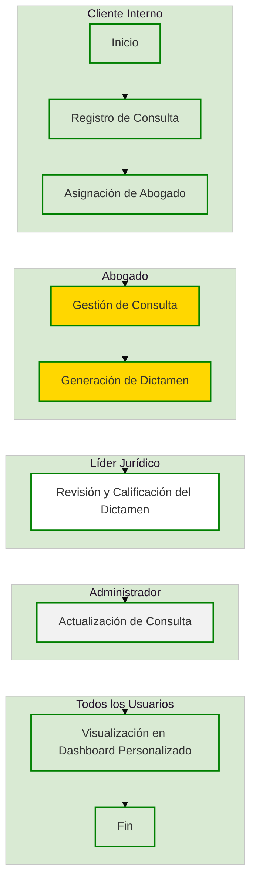
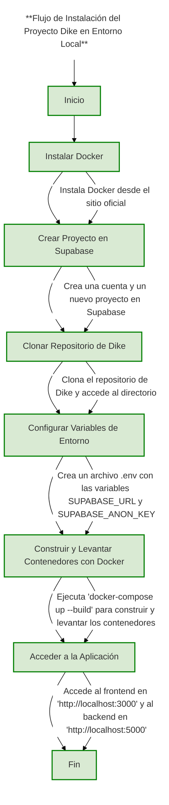
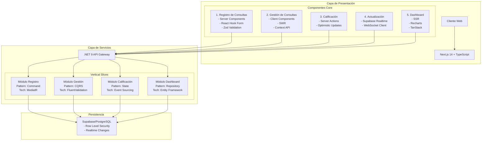
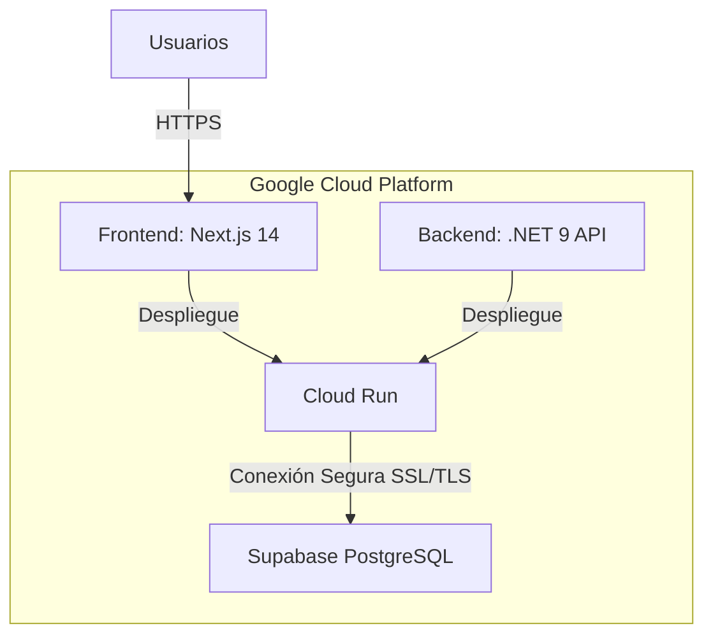
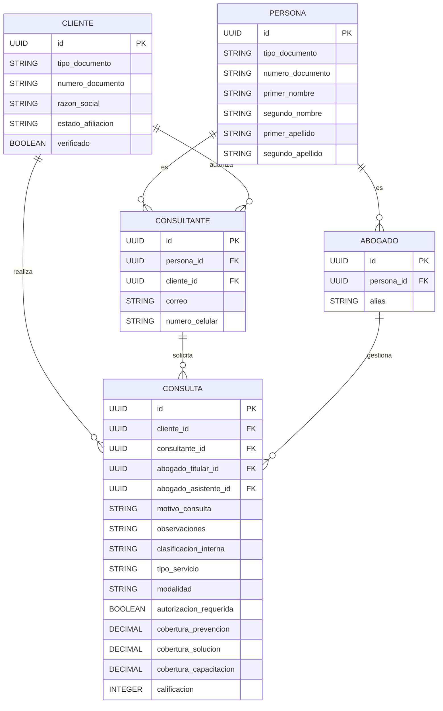

## Índice

0. [Ficha del proyecto](#0-ficha-del-proyecto)
1. [Descripción general del producto](#1-descripción-general-del-producto)
2. [Arquitectura del sistema](#2-arquitectura-del-sistema)
3. [Modelo de datos](#3-modelo-de-datos)
4. [Especificación de la API](#4-especificación-de-la-api)
5. [Historias de usuario](#5-historias-de-usuario)
6. [Tickets de trabajo](#6-tickets-de-trabajo)
7. [Pull requests](#7-pull-requests)

---
## 0. Ficha del proyecto

### **0.1. Tu nombre completo: Leandro Alberto Garcia Silva** 

### **0.2. Nombre del proyecto: Dike**

### **0.3. Descripción breve del proyecto:**
Dike es una plataforma integral diseñada para optimizar la gestión de consultas jurídicas. Facilita el registro, seguimiento y resolución de casos legales, proporcionando herramientas eficientes para profesionales del derecho y funcionalidades avanzadas para líderes jurídicos. Su objetivo es mejorar la eficiencia, transparencia y precisión en la administración de consultas, reduciendo riesgos de errores y posibles sanciones.
### **0.4. URL del proyecto:**
**Pendiente**
> Puede ser pública o privada, en cuyo caso deberás compartir los accesos de manera segura. Puedes enviarlos a [alvaro@lidr.co](mailto:alvaro@lidr.co) usando algún servicio como [onetimesecret](https://onetimesecret.com/).

### 0.5. URL o archivo comprimido del repositorio
**Pendiente**
> Puedes tenerlo alojado en público o en privado, en cuyo caso deberás compartir los accesos de manera segura. Puedes enviarlos a [alvaro@lidr.co](mailto:alvaro@lidr.co) usando algún servicio como [onetimesecret](https://onetimesecret.com/). También puedes compartir por correo un archivo zip con el contenido


---

## 1. Descripción general del producto

### **1.1. Objetivo:**

#### **Propósito Principal**

Dike es una plataforma integral diseñada para optimizar la gestión de consultas legales en despachos, departamentos jurídicos y profesionales del derecho. Su enfoque principal radica en la centralización del registro, seguimiento y administración de consultas, automatizando tareas administrativas para reducir la carga de trabajo manual y minimizar errores. Esto permite a los equipos legales concentrarse en actividades estratégicas y mejorar la atención personalizada a los clientes, garantizando eficiencia, trazabilidad y seguridad en la información.

#### **Problemas que Soluciona y Valor que Aporta**

- **Automatización de procesos**: Reduce la carga operativa al minimizar tareas repetitivas y mejorar la eficiencia del equipo legal.
- **Gestión centralizada y trazabilidad**: Facilita el acceso seguro y organizado a información clave, asegurando una colaboración efectiva y registros completos de cada consulta.
- **Monitoreo y control de procesos**: Proporciona herramientas de seguimiento en tiempo real para garantizar el cumplimiento de plazos y responsabilidades.
- **Comunicación estructurada**: Mejora la interacción entre equipos legales y clientes, promoviendo la transparencia y manteniendo un historial detallado de cada gestión.

#### **Público Objetivo**

- Despachos de abogados de cualquier tamaño.
- Departamentos legales corporativos.
- Profesionales independientes del derecho que buscan optimizar su trabajo.
- Instituciones gubernamentales o reguladoras con necesidades de gestión legal.

### **1.2. Características y funcionalidades principales:**

Para el desarrollo del **Producto Mínimo Viable (MVP)** de **Dike**, es esencial centrarse en funcionalidades que aporten valor inmediato a los usuarios. A continuación, se detallan las funcionalidades clave a incluir en la primera versión:

#### **Funcionalidades clave para el MVP:**

![[Caracteristicas_dike.png]]

- **Registro de Consultas:**  
    Permite registrar, documentar y organizar las consultas legales recibidas, asignando un abogado responsable y estableciendo prioridades según su urgencia.
    
- **Gestión de Consultas:**  
    Interfaz que permitirá al abogado gestionar la consulta asignada, validando el motivo de la consulta y proporcionando un dictamen basado en la información proporcionada.
    
- **Calificación de Consultas:**  
    Funcionalidad que permite al líder verificar y evaluar el dictamen de la consulta emitido por el abogado, asegurando la calidad del análisis antes de proceder con su resolución o cierre.
    
- **Actualización de Consultas:**  
    Permite registrar y mantener actualizada toda la información relevante de cada consulta. Si el usuario cuenta con los permisos adecuados, podrá modificar la consulta cuando sea necesario.
    
- **Dashboard Personalizado:**  
    Tablero que ofrece una visión general del estado actual de las consultas asignadas a cada abogado o grupo jurídico. Incluye indicadores visuales, como un sistema de semaforización por colores, que facilita la identificación rápida del estado de cada consulta.




### **1.3. Diseño y experiencia de usuario:**

El diseño de la plataforma **Dike** se basará en una combinación de componentes de interfaz modernos y accesibles, utilizando un **template de mercado** junto con **shadcn y V0** como gestor de componentes. Esto permitirá una experiencia visual profesional y una integración eficiente con las tecnologías utilizadas en el desarrollo.

#### **Paleta de colores**

La identidad visual de la plataforma estará definida por los siguientes colores:

- **🌿 Verde Primario** `#008000`
- **🍃 Verde Claro** `#D9EAD3`
- **⚪ Blanco** `#FFFFFF`
- **🌫️ Gris Claro** `#F2F2F2`
- **⚫ Gris Oscuro** `#333333`
- **🌟 Amarillo/Mostaza** `#FFD700`

Esta combinación de colores proporcionará una interfaz limpia, moderna y accesible, manteniendo un equilibrio entre profesionalismo y usabilidad.

#### **Tipografía y lineamientos de estilo**

La plataforma seguirá una línea visual coherente, asegurando una experiencia de usuario fluida y uniforme. Se utilizarán componentes estilizados con **shadcn**, adaptados para ofrecer una interfaz clara y funcional.

#### **Evolución del diseño**

En esta fase temprana, no se incluirán imágenes, wireframes ni videotutoriales. Sin embargo, estos elementos serán detallados en etapas posteriores del desarrollo, cuando se disponga de prototipos más avanzados.
### **1.4. Instrucciones de instalación:**

Para poner en marcha el proyecto **Dike** en un entorno local, sigue los pasos detallados a continuación. Este proyecto utiliza **.NET 9** para el backend, **Next.js** para el frontend y **Supabase** como base de datos. Tanto el backend como el frontend están contenerizados utilizando **Docker**, y se implementa un flujo de CI/CD para despliegues automáticos.

![[Instrucciones_Instalacion.png]]

**Requisitos previos:**

- **Docker**: Asegúrate de tener Docker instalado en tu máquina. Puedes descargarlo e instalarlo desde [Docker Official Website](https://www.docker.com/).
    
- **Supabase**: Crea una cuenta en [Supabase](https://supabase.com/) y configura un nuevo proyecto. Obtén la URL del proyecto y la clave anónima (anon key) para la conexión.
    

**Pasos de instalación:**

1. **Clonar el repositorio:**
    
    ```bash
    git clone <URL_DEL_REPOSITORIO_DE_DIKE>
    cd Dike
    ```
    
2. **Configurar variables de entorno:**
    
    Crea un archivo `.env` en la raíz del proyecto y añade las siguientes variables:
    
    ```env
    # Variables para el backend
    SUPABASE_URL=<TU_SUPABASE_URL>
    SUPABASE_ANON_KEY=<TU_SUPABASE_ANON_KEY>
    
    # Variables para el frontend
    NEXT_PUBLIC_SUPABASE_URL=<TU_SUPABASE_URL>
    NEXT_PUBLIC_SUPABASE_ANON_KEY=<TU_SUPABASE_ANON_KEY>
    ```
    
    Reemplaza `<TU_SUPABASE_URL>` y `<TU_SUPABASE_ANON_KEY>` con los valores correspondientes de tu proyecto de Supabase.
    
3. **Construir y levantar los contenedores con Docker:**
    
    El proyecto está configurado para utilizar Docker Compose, lo que facilita la construcción y ejecución de los servicios. Ejecuta:
    
    ```bash
    docker-compose up --build
    ```
    
    Este comando construirá las imágenes de Docker para el backend y el frontend, y luego levantará los contenedores correspondientes.
    
4. **Acceder a la aplicación:**
    
    - **Frontend**: Una vez que los contenedores estén en funcionamiento, puedes acceder al frontend de **Dike** navegando a `http://localhost:3000`.
        
    - **Backend**: El backend estará disponible en `http://localhost:5000`.
        

**Notas adicionales:**

- **Gestión de dependencias**: No es necesario instalar manualmente las dependencias del backend o frontend, ya que Docker se encarga de ello durante el proceso de construcción.
    
- **Migraciones de base de datos**: Asegúrate de que las migraciones necesarias se ejecuten correctamente al iniciar la aplicación. Puedes verificar los logs del contenedor del backend para confirmar que las migraciones se aplicaron sin problemas.
    
- **CI/CD**: El proyecto está configurado para despliegues automáticos utilizando un flujo de CI/CD. Cada vez que se realice un push a la rama principal del repositorio, se desencadenará un proceso de construcción y despliegue automático.


## 2. Arquitectura del Sistema

### **2.1. Diagrama de arquitectura:**

### 2.1. Diagrama de arquitectura

El sistema Dike está diseñado para gestionar consultas jurídicas de manera eficiente, implementando una arquitectura que prioriza la separación de responsabilidades y la escalabilidad.

#### Componentes Principales y Tecnologías



#### Patrones Arquitectónicos y su Aplicación

1. **Feature-First Architecture (Frontend)**
   - *¿Por qué?* Organiza el código por funcionalidad de negocio, facilitando el desarrollo y mantenimiento de cada módulo de forma independiente.
   - *Aplicación:* Cada funcionalidad (registro, gestión, etc.) tiene sus propios componentes, hooks y servicios.
   - *Beneficio:* Equipos pueden trabajar en paralelo sin conflictos.

2. **Vertical Slice Architecture (Backend)**
   - *¿Por qué?* Permite manejar cada funcionalidad de forma aislada y completa.
   - *Aplicación:* Cada slice contiene toda la lógica necesaria para una funcionalidad específica.
   - *Beneficio:* Mayor cohesión y menor acoplamiento entre funcionalidades.

#### Justificación de Decisiones Arquitectónicas

1. **Next.js con Server/Client Components**
   - *Necesidad:* Optimizar la carga inicial y la interactividad.
   - *Solución:* Server Components para contenido estático (dashboards) y Client Components para interacciones ricas (formularios).
   - *Resultado:* Mejor experiencia de usuario y rendimiento.

2. **Vertical Slices en .NET 9**
   - *Necesidad:* Gestionar funcionalidades complejas de forma aislada.
   - *Solución:* Cada slice maneja su propia lógica, validaciones y persistencia.
   - *Resultado:* Mantenibilidad y escalabilidad mejorada.

3. **Supabase como Base de Datos**
   - *Necesidad:* Seguridad y tiempo real para consultas jurídicas.
   - *Solución:* Row Level Security y suscripciones en tiempo real.
   - *Resultado:* Control de acceso granular y actualizaciones instantáneas.

#### Beneficios Clave para el Proyecto

4. **Funcionalidades Jurídicas**
   - Control granular de permisos por rol
   - Auditoría completa de cambios
   - Notificaciones en tiempo real

5. **Performance**
   - Carga inicial rápida con SSR
   - Actualizaciones optimistas
   - Caché inteligente por funcionalidad

6. **Desarrollo y Mantenimiento**
   - Desarrollo paralelo por módulo
   - Testing simplificado
   - Despliegue independiente

#### Sacrificios y Estrategias de Mitigación

| Aspecto | Sacrificio | Mitigación |
|---------|------------|------------|
| Complejidad | Mayor curva de aprendizaje inicial | Documentación detallada por funcionalidad |
| Performance | Overhead por separación de slices | Implementación de caché estratégico |
| Desarrollo | Posible duplicación entre slices | Shared kernel para código común |
| Operación | Mayor complejidad de monitoreo | APM tools específicas por funcionalidad |

La arquitectura elegida prioriza la mantenibilidad y escalabilidad necesarias para un sistema jurídico, aceptando una complejidad inicial mayor en favor de beneficios a largo plazo en desarrollo y operación.
### **2.2. Descripción de componentes principales:**

La arquitectura de Dike se compone de tres capas principales, cada una con sus componentes específicos:

#### 1. Capa de Presentación (Next.js 14 + TypeScript)

**Server Components**
- Implementados en el Registro de Consultas
- Utilizados en el Dashboard
- *Tecnologías:* React Hook Form, Zod Validation, SSR
- *Propósito:* Optimizar la carga inicial y SEO

**Client Components**
- Implementados en la Gestión de Consultas
- Utilizados en interacciones complejas
- *Tecnologías:* SWR, Context API
- *Propósito:* Proporcionar interactividad rica

**Componentes Híbridos**
- Implementados en Calificación y Actualización
- *Tecnologías:* Server Actions, Supabase Realtime
- *Propósito:* Combinar rendimiento con interactividad

#### 2. Capa de Servicios (.NET 9 API Gateway)

**Módulo de Registro**
- Patrón Command
- *Tecnologías:* MediatR
- *Propósito:* Manejo de comandos y validaciones

**Módulo de Gestión**
- Patrón CQRS
- *Tecnologías:* FluentValidation
- *Propósito:* Separación de operaciones de lectura/escritura

**Módulo de Calificación**
- Patrón State + Event Sourcing
- *Tecnologías:* Domain Events
- *Propósito:* Manejo de estados y auditoría

**Módulo de Dashboard**
- Patrón Repository
- *Tecnologías:* Entity Framework Core
- *Propósito:* Acceso optimizado a datos

#### 3. Capa de Persistencia (Supabase/PostgreSQL)

**Características Principales**
- Row Level Security
- Realtime Changes
- *Tecnologías:* PostgreSQL 15
- *Propósito:* Almacenamiento y seguridad de datos

#### Comunicación entre Capas

**Frontend a Servicios**
- API REST para operaciones CRUD
- *Tecnologías:* Fetch API
- *Propósito:* Comunicación cliente-servidor eficiente

**Servicios a Persistencia**
- Entity Framework Core para operaciones síncronas
- Supabase SDK para tiempo real
- *Tecnologías:* ADO.NET, Supabase
- *Propósito:* Acceso a datos optimizado

#### Componentes Transversales

**Seguridad**
- Autenticación basada en JWT
- Autorización por roles
- Row Level Security en base de datos
- *Propósito:* Protección integral de datos

**Caché**
- Implementado a nivel de aplicación con SWR
- Estrategia stale-while-revalidate
- *Tecnologías:* SWR, Next.js
- *Propósito:* Optimización de rendimiento en cliente

### **2.3. Descripción de alto nivel del proyecto y estructura de ficheros**

Como arquitecto de software, puedo proporcionarte una descripción detallada de alto nivel del proyecto **Dike** y su estructura de ficheros, destacando el propósito de las carpetas principales y los patrones arquitectónicos implementados.

**Descripción General del Proyecto:**

**Dike** es una plataforma diseñada para la gestión eficiente de consultas jurídicas. Su arquitectura se centra en la separación de responsabilidades y la escalabilidad, implementando tecnologías modernas tanto en el frontend como en el backend.

**Estructura del Proyecto:**

A continuación, se presenta la estructura principal del proyecto:

```
Dike/
├── backend/
│   ├── src/
│   │   ├── Dike.Api/
│   │   ├── Dike.Application/
│   │   ├── Dike.Domain/
│   │   └── Dike.Infrastructure/
│   ├── tests/
│   │   ├── Dike.Api.Tests/
│   │   ├── Dike.Application.Tests/
│   │   └── Dike.Domain.Tests/
│   └── Dike.sln
├── frontend/
│   ├── app/
│   │   ├── consultas/
│   │   ├── gestion/
│   │   ├── calificacion/
│   │   ├── actualizacion/
│   │   └── dashboard/
│   ├── components/
│   ├── public/
│   ├── styles/
│   └── next.config.js
├── docs/
│   ├── architecture/
│   ├── api/
│   └── user_manual/
├── scripts/
├── docker-compose.yml
└── README.md
```

**Propósito de las Carpetas Principales:**

- `backend/`: Contiene todo el código fuente y las pruebas relacionadas con el backend del proyecto, desarrollado en **.NET 9**.
    
    - `src/`: Directorio principal del código fuente.
        - `Dike.Api/`: Implementación de la API RESTful que expone los servicios del backend.
        - `Dike.Application/`: Contiene la lógica de aplicación, incluyendo casos de uso y servicios.
        - `Dike.Domain/`: Define las entidades del dominio y las interfaces de los repositorios, siguiendo el patrón **Domain-Driven Design (DDD)**.
        - `Dike.Infrastructure/`: Implementación de los repositorios, proveedores de servicios y configuración de la base de datos.
    - `tests/`: Proyectos de pruebas unitarias y de integración para el backend.
        - `Dike.Api.Tests/`: Pruebas relacionadas con la API.
        - `Dike.Application.Tests/`: Pruebas de la lógica de aplicación.
        - `Dike.Domain.Tests/`: Pruebas de las entidades y lógica de dominio.
    - `Dike.sln`: Archivo de solución de Visual Studio que agrupa todos los proyectos del backend.
- `frontend/`: Contiene el código fuente del frontend, desarrollado con **Next.js 14** y **TypeScript**.
    
    - `app/`: Directorio principal de la aplicación, siguiendo la convención del App Router de Next.js.
        - `consultas/`: Módulo para el registro y visualización de consultas jurídicas.
        - `gestion/`: Módulo para la gestión y seguimiento de consultas.
        - `calificacion/`: Módulo para la evaluación y calificación de respuestas.
        - `actualizacion/`: Módulo para la actualización en tiempo real de estados y notificaciones.
        - `dashboard/`: Módulo de panel de control con estadísticas y métricas clave.
    - `components/`: Componentes reutilizables de la interfaz de usuario.
    - `public/`: Archivos estáticos como imágenes, fuentes y otros recursos públicos.
    - `styles/`: Archivos de estilos globales y módulos CSS.
    - `next.config.js`: Archivo de configuración de Next.js.
- `docs/`: Documentación del proyecto.
    
    - `architecture/`: Diagramas y descripciones de la arquitectura del sistema.
    - `api/`: Documentación de los endpoints de la API.
    - `user_manual/`: Manual de usuario y guías de uso.
- `scripts/`: Scripts auxiliares para tareas como despliegue, migraciones de base de datos y otros automatismos.
    
- `docker-compose.yml`: Archivo de configuración para Docker Compose, que define los servicios, redes y volúmenes necesarios para ejecutar la aplicación en contenedores.
    
- `README.md`: Documento principal que ofrece una visión general del proyecto, instrucciones de instalación y otra información relevante.
    

**Patrones y Arquitectura Implementados:**

- **Frontend:**
    
    - **Feature-First Architecture:** La organización del frontend sigue una arquitectura orientada a funcionalidades, donde cada módulo dentro de `app/` representa una característica específica del sistema. Esto facilita el desarrollo y mantenimiento de cada módulo de forma independiente.
    - **Componentes Colocalizados:** Los componentes, estilos y pruebas relacionados con una funcionalidad específica se encuentran dentro del mismo módulo, promoviendo la cohesión y facilitando la navegación por el código.
- **Backend:**
    
    - **Domain-Driven Design (DDD):** La estructura del backend está diseñada siguiendo los principios de DDD, separando claramente las capas de dominio, aplicación, infraestructura y API. Esto permite una mejor organización del código y una mayor adaptabilidad a cambios en los requisitos de negocio.
    - **Vertical Slice Architecture:** Cada módulo o "slice" del backend maneja una funcionalidad específica de manera integral, incluyendo su propia lógica de negocio, validaciones y acceso a datos. Esto reduce el acoplamiento entre módulos y mejora la escalabilidad del sistema.

### **2.4. Infraestructura y despliegue**

**Infraestructura del Proyecto:**

El sistema **Dike** está diseñado para gestionar consultas jurídicas de manera eficiente, utilizando una arquitectura que prioriza la escalabilidad y la seguridad. A continuación, se presenta un diagrama que ilustra la infraestructura propuesta:



**Descripción de Componentes:**

1. **Frontend:**
    
    - **Tecnología:** Next.js 14
    - **Despliegue:** Implementado en **Google Cloud Run**, un servicio de computación sin servidor que permite ejecutar aplicaciones en contenedores de manera escalable.
2. **Backend:**
    
    - **Tecnología:** .NET 9
    - **Despliegue:** También desplegado en **Google Cloud Run**, facilitando la gestión y escalabilidad de las APIs del sistema.
3. **Base de Datos:**
    
    - **Servicio:** **Supabase** utilizando **PostgreSQL** como sistema de gestión de bases de datos.
    - **Seguridad:** Supabase ofrece cifrado de datos tanto en tránsito como en reposo, garantizando la protección de la información sensible y cumpliendo con normativas legales aplicables.

**Proceso de Despliegue:**

El despliegue del sistema **Dike** se realiza siguiendo una serie de pasos para asegurar una implementación eficiente y segura:

4. **Preparación del Entorno:**
    
    - **Repositorio de Código:** El código fuente se mantiene en un sistema de control de versiones, como **GitHub** o **GitLab**.
    - **Integración Continua (CI):** Se configura una herramienta de CI para automatizar pruebas y asegurarse de que el código es estable antes del despliegue.
5. **Construcción y Empaquetado:**
    
    - **Dockerización:** Tanto el frontend como el backend se empaquetan en contenedores Docker, asegurando consistencia en los entornos de desarrollo y producción.
6. **Despliegue en Google Cloud Run:**
    
    - **Configuración de Servicios:** Se crean servicios en **Cloud Run** para el frontend y el backend, especificando los recursos necesarios y las variables de entorno.
    - **Implementación:** Utilizando comandos de la CLI de Google Cloud o pipelines de CI/CD, se despliegan las imágenes de Docker en los servicios correspondientes.
7. **Conexión con Supabase:**
    
    - **Configuración de la Base de Datos:** Se establece la conexión entre los servicios desplegados en **Cloud Run** y la base de datos de **Supabase**, asegurando el uso de conexiones seguras (SSL/TLS).

### **2.5. Seguridad**

**1. Control de Acceso:**

- **Autenticación de Usuarios:**
    
    - _Implementación:_ Se ha integrado **NextAuth.js** en la aplicación **Next.js 14** para gestionar la autenticación de usuarios. Esta biblioteca facilita la incorporación de diversos proveedores de autenticación y la gestión segura de sesiones.
    - _Ejemplo:_ Un usuario puede registrarse utilizando su correo electrónico y contraseña. NextAuth.js maneja la creación de la sesión y almacena tokens de autenticación en cookies seguras, protegiendo la información de acceso.
- **Gestión de Sesiones:**
    
    - _Implementación:_ **NextAuth.js** se encarga de la gestión de sesiones, asegurando que las cookies de sesión sean seguras y de solo lectura (HttpOnly), lo que impide el acceso a través de scripts del lado del cliente.
    - _Ejemplo:_ Tras iniciar sesión, la sesión del usuario tiene una duración determinada. Si el usuario permanece inactivo más allá de este período, se le solicitará que vuelva a autenticarse, reduciendo el riesgo de accesos no autorizados.

**2. Protección de Datos:**

- **Cifrado en Tránsito:**
    
    - _Implementación:_ Todas las comunicaciones entre el cliente y el servidor se realizan a través de HTTPS, utilizando SSL/TLS para cifrar los datos en tránsito.
    - _Ejemplo:_ Cuando un usuario envía una consulta jurídica a través de la aplicación, la información se transmite cifrada, evitando que terceros intercepten los datos durante su transmisión.
- **Cifrado en Reposo:**
    
    - _Implementación:_ La base de datos de **Supabase**, que utiliza **PostgreSQL**, cifra automáticamente los datos almacenados para proteger la información sensible.
    - _Ejemplo:_ Los detalles de las consultas jurídicas y la información personal de los usuarios se almacenan cifrados en la base de datos, garantizando su confidencialidad incluso si se accede directamente al almacenamiento físico.

**3. Validación de Entradas:**

- **Sanitización de Datos:**
    
    - _Implementación:_ Se emplean **React Hook Form** y **Zod** en el frontend para validar y sanitizar las entradas de usuario, asegurando que los datos cumplan con los formatos esperados antes de ser procesados o almacenados.
    - _Ejemplo:_ Al registrar una nueva consulta, el formulario valida que todos los campos requeridos estén completos y que los datos ingresados tengan el formato correcto, previniendo posibles inyecciones de código o datos malformados.
- **Uso de Librerías de Validación:**
    
    - _Implementación:_ En el backend, se utiliza **Zod** para validar los datos recibidos en las API endpoints, garantizando la integridad y seguridad de la información procesada.
    - _Ejemplo:_ Antes de almacenar una nueva consulta en la base de datos, el backend verifica que los datos cumplen con el esquema definido, rechazando cualquier información que no se ajuste a los criterios establecidos.

**4. Gestión de Errores:**

- **Manejo Centralizado de Errores:**
    
    - _Implementación:_ El sistema cuenta con una gestión centralizada de errores que registra y notifica cualquier fallo, facilitando su detección y resolución oportuna.
    - _Ejemplo:_ Si ocurre un error durante el procesamiento de una solicitud, el sistema registra el incidente y envía una notificación al equipo de desarrollo para su pronta atención.
- **Mensajes de Error Genéricos:**
    
    - _Implementación:_ Para evitar revelar información sensible, los mensajes de error mostrados al usuario son genéricos y no detallan la naturaleza exacta del fallo.
    - _Ejemplo:_ Si un usuario intenta acceder a una página sin los permisos adecuados, se le muestra un mensaje como "Acceso denegado" sin proporcionar detalles adicionales sobre la causa.

**5. Configuración Segura por Defecto:**

- **Principio de Privilegios Mínimos:**
    
    - _Implementación:_ Los roles y permisos de usuario se configuran para otorgar únicamente los accesos necesarios para realizar sus funciones específicas, minimizando el riesgo de accesos indebidos.
    - _Ejemplo:_ Un usuario con rol de "Asesor Jurídico" solo tiene acceso a las funcionalidades relacionadas con la gestión de consultas asignadas, sin posibilidad de modificar configuraciones del sistema.
- **Desactivación de Funcionalidades No Utilizadas:**
    
    - _Implementación:_ Cualquier servicio, puerto o funcionalidad que no sea esencial para el funcionamiento del MVP se mantiene deshabilitado para reducir la superficie de ataque.
    - _Ejemplo:_ Si no se utiliza un módulo específico en esta fase del proyecto, se asegura que esté completamente desactivado hasta que sea necesario.

### **2.6. Tests**

Para garantizar la calidad y funcionalidad del sistema **Dike**, se han implementado los siguientes tipos de pruebas:

**1. Pruebas Unitarias:**

- _Descripción:_ Estas pruebas se centran en verificar el correcto funcionamiento de componentes individuales del sistema, como funciones o métodos específicos, asegurando que cada unidad de código opere según lo esperado de manera aislada.
    
- _Implementación en Dike:_
    
    - **Frontend:** Se utiliza **Jest** junto con **React Testing Library** para probar componentes de React desarrollados en **Next.js 14**. Por ejemplo, se verifica que el componente de formulario de registro de consultas renderice correctamente y maneje adecuadamente los cambios en los campos de entrada.
    - **Backend:** Se emplea **xUnit.net** para **.NET 9**, probando métodos individuales de los servicios de la API. Un caso específico es la validación de la lógica en el método que calcula la prioridad de una consulta jurídica basada en su urgencia y complejidad.

**2. Pruebas de Integración:**

- _Descripción:_ Evalúan la interacción entre múltiples componentes o módulos del sistema, identificando problemas que puedan surgir cuando diferentes partes trabajan conjuntamente.
    
- _Implementación en Dike:_
    
    - **Frontend-Backend:** Se utilizan herramientas como **Supertest** para simular solicitudes HTTP desde el frontend hacia la API backend, asegurando que la comunicación y el intercambio de datos se realicen correctamente. Por ejemplo, se prueba que al enviar una nueva consulta desde el frontend, el backend la procese y almacene adecuadamente en la base de datos.
    - **Backend-Base de Datos:** Mediante **Entity Framework Core InMemory Database**, se realizan pruebas que validan la interacción entre los servicios backend y la base de datos **Supabase** (PostgreSQL). Un caso específico es verificar que, tras la creación de una nueva consulta, esta se registre correctamente en la base de datos con todos los campos requeridos.

**3. Pruebas Funcionales:**

- _Descripción:_ Verifican que el sistema cumpla con los requisitos funcionales establecidos, asegurando que cada función opere conforme a las especificaciones y satisfaga las necesidades del usuario.
    
- _Implementación en Dike:_
    
    - **Escenarios de Usuario:** Se emplea **Cypress** para automatizar pruebas que simulan flujos completos de usuario en la aplicación web. Por ejemplo, se prueba que un usuario pueda registrarse, iniciar sesión, crear una nueva consulta jurídica y recibir una confirmación de que su consulta ha sido registrada exitosamente.
    - **Validación de Reglas de Negocio:** Utilizando **SpecFlow** en el backend, se definen y prueban escenarios que validan reglas de negocio críticas. Un caso específico es asegurar que solo los usuarios con el rol de "Administrador" puedan acceder a la funcionalidad de gestión de usuarios dentro del sistema.

---

## 3. Modelo de Datos

### **3.1. Diagrama del modelo de datos:**



**Descripción de las tablas y relaciones:**

- **PERSONA**: Contiene información básica de las personas involucradas en el sistema, incluyendo tipo y número de documento, nombres y apellidos.
    
- **CLIENTE**: Representa a las entidades que pueden ser personas naturales o jurídicas, con campos como tipo y número de documento, razón social, estado de afiliación y verificación.
    
- **CONSULTANTE**: Personas autorizadas por un cliente para realizar consultas. Se relaciona con la tabla PERSONA a través de `persona_id` y con CLIENTE mediante `cliente_id`. Incluye información de contacto como correo y número de celular.
    
- **ABOGADO**: Profesionales legales registrados en el sistema. Heredan información de la tabla PERSONA mediante `persona_id` y tienen un campo adicional `alias` para su identificación en los tableros.
    
- **CONSULTA**: Registro de las consultas jurídicas realizadas. Se relaciona con CLIENTE (`cliente_id`), CONSULTANTE (`consultante_id`), ABOGADO titular (`abogado_titular_id`) y ABOGADO asistente (`abogado_asistente_id`). Incluye detalles como motivo de la consulta, observaciones, clasificación interna, tipo de servicio, modalidad, si requiere autorización, coberturas y calificación.
    
**Relaciones clave:**

- Una **PERSONA** puede ser un **CONSULTANTE** o un **ABOGADO**.
    
- Un **CLIENTE** puede autorizar a múltiples **CONSULTANTES** y realizar múltiples **CONSULTAS**.
    
- Un **CONSULTANTE** puede solicitar varias **CONSULTAS**.
    
- Un **ABOGADO** puede gestionar varias **CONSULTAS** como titular o asistente.
### **3.2. Descripción de entidades principales:**

### 1. PERSONA

Esta entidad almacena la información básica de las personas involucradas en el sistema, como abogados, consultantes y otros usuarios.

- **Atributos:**
    
    - `id` (UUID): Clave primaria única de la persona.
    - `tipo_documento` (STRING): Tipo de documento de identificación (e.g., CC, NIT).
    - `numero_documento` (STRING): Número del documento de identificación.
    - `primer_nombre` (STRING): Primer nombre de la persona.
    - `segundo_nombre` (STRING): Segundo nombre de la persona (opcional).
    - `primer_apellido` (STRING): Primer apellido de la persona.
    - `segundo_apellido` (STRING): Segundo apellido de la persona (opcional).
- **Restricciones:**
    
    - `id`: No nulo, único.
    - `tipo_documento`: No nulo.
    - `numero_documento`: No nulo, único.
    - `primer_nombre`: No nulo.
    - `primer_apellido`: No nulo.

### 2. CLIENTE

Representa a las entidades que pueden ser personas naturales o jurídicas que solicitan servicios.

- **Atributos:**
    
    - `id` (UUID): Clave primaria única del cliente.
    - `tipo_documento` (STRING): Tipo de documento de identificación del cliente.
    - `numero_documento` (STRING): Número del documento de identificación.
    - `razon_social` (STRING): Nombre o razón social del cliente.
    - `estado_afiliacion` (STRING): Estado de la afiliación (e.g., Activo, Inactivo).
    - `verificado` (BOOLEAN): Indica si la información del cliente ha sido verificada.
- **Restricciones:**
    
    - `id`: No nulo, único.
    - `tipo_documento`: No nulo.
    - `numero_documento`: No nulo, único.
    - `razon_social`: No nulo.
    - `estado_afiliacion`: No nulo.
    - `verificado`: No nulo, valor por defecto `false`.

### 3. CONSULTANTE

Personas autorizadas por un cliente para realizar consultas.

- **Atributos:**
    
    - `id` (UUID): Clave primaria única del consultante.
    - `persona_id` (UUID): Clave foránea que referencia a la entidad PERSONA.
    - `cliente_id` (UUID): Clave foránea que referencia a la entidad CLIENTE.
    - `correo` (STRING): Correo electrónico del consultante.
    - `numero_celular` (STRING): Número de celular del consultante.
- **Restricciones:**
    
    - `id`: No nulo, único.
    - `persona_id`: No nulo, debe existir en PERSONA.
    - `cliente_id`: No nulo, debe existir en CLIENTE.
    - `correo`: No nulo, único.
    - `numero_celular`: No nulo.
- **Relaciones:**
    
    - Muchos CONSULTANTES pueden estar asociados a un CLIENTE (relación muchos a uno).
    - Cada CONSULTANTE está vinculado a una PERSONA (relación uno a uno).

### 4. ABOGADO

Profesionales legales registrados en el sistema.

- **Atributos:**
    
    - `id` (UUID): Clave primaria única del abogado.
    - `persona_id` (UUID): Clave foránea que referencia a la entidad PERSONA.
    - `alias` (STRING): Nombre profesional o seudónimo del abogado.
- **Restricciones:**
    
    - `id`: No nulo, único.
    - `persona_id`: No nulo, debe existir en PERSONA.
    - `alias`: No nulo, único.
- **Relaciones:**
    
    - Cada ABOGADO está vinculado a una PERSONA (relación uno a uno).
    - Un ABOGADO puede ser asignado como profesional titular o asistente en múltiples CONSULTAS (relación uno a muchos).

### 5. CONSULTA

Registro de las consultas jurídicas realizadas por los clientes.

- **Atributos:**
    - `id` (UUID): Clave primaria única de la consulta.
    - `cliente_id` (UUID): Clave foránea que referencia a la entidad CLIENTE.
    - `consultante_id` (UUID): Clave foránea que referencia a la entidad CONSULTANTE.
    - `abogado_titular_id` (UUID): Clave foránea que referencia a la entidad ABOGADO como titular.

---

## 4. Especificación de la API

```yaml
openapi: 3.0.1
info:
  title: API de Dike
  version: 1.0.0
servers:
  - url: https://api.dike.com/v1
paths:
  /clientes:
    get:
      summary: Obtiene una lista de todos los clientes.
      responses:
        200:
          description: Lista de clientes obtenida exitosamente.
          content:
            application/json:
              schema:
                type: array
                items:
                  $ref: '#/components/schemas/Cliente'
    post:
      summary: Crea un nuevo cliente.
      requestBody:
        required: true
        content:
          application/json:
            schema:
              $ref: '#/components/schemas/Cliente'
      responses:
        201:
          description: Cliente creado exitosamente.
          content:
            application/json:
              schema:
                $ref: '#/components/schemas/Cliente'
  /consultas:
    get:
      summary: Obtiene una lista de todas las consultas.
      responses:
        200:
          description: Lista de consultas obtenida exitosamente.
          content:
            application/json:
              schema:
                type: array
                items:
                  $ref: '#/components/schemas/Consulta'
    post:
      summary: Crea una nueva consulta.
      requestBody:
        required: true
        content:
          application/json:
            schema:
              $ref: '#/components/schemas/Consulta'
      responses:
        201:
          description: Consulta creada exitosamente.
          content:
            application/json:
              schema:
                $ref: '#/components/schemas/Consulta'
  /abogados:
    get:
      summary: Obtiene una lista de todos los abogados.
      responses:
        200:
          description: Lista de abogados obtenida exitosamente.
          content:
            application/json:
              schema:
                type: array
                items:
                  $ref: '#/components/schemas/Abogado'
components:
  schemas:
    Cliente:
      type: object
      properties:
        id:
          type: string
          format: uuid
          description: Identificador único del cliente.
        tipo_documento:
          type: string
          description: Tipo de documento de identificación del cliente.
        numero_documento:
          type: string
          description: Número del documento de identificación.
        razon_social:
          type: string
          description: Nombre o razón social del cliente.
        estado_afiliacion:
          type: string
          description: Estado de la afiliación (e.g., Activo, Inactivo).
        verificado:
          type: boolean
          description: Indica si la información del cliente ha sido verificada.
      required:
        - tipo_documento
        - numero_documento
        - razon_social
        - estado_afiliacion
    Consulta:
      type: object
      properties:
        id:
          type: string
          format: uuid
          description: Identificador único de la consulta.
        cliente_id:
          type: string
          format: uuid
          description: Identificador único del cliente que realiza la consulta.
        consultante_id:
          type: string
          format: uuid
          description: Identificador único del consultante que realiza la consulta.
        abogado_titular_id:
          type: string
          format: uuid
          description: Identificador único del abogado titular asignado.
        abogado_asistente_id:
          type: string
          format: uuid
          description: Identificador único del abogado asistente asignado.
        motivo_consulta:
          type: string
          description: Descripción del problema legal o pregunta.
        observaciones:
          type: string
          description: Notas adicionales o comentarios.
        clasificacion_interna:
          type: string
          description: Categoría interna de la consulta.
        tipo_servicio:
          type: string
          description: Clase de servicio legal requerido.
        modalidad:
          type: string
          description: Forma en que se prestará el servicio (presencial, virtual, etc.).
        autorizacion_requerida:
          type: boolean
          description: Indica si se necesita una autorización para el servicio.
        cobertura_prevencion:
          type: number
          format: float
          description: Porcentaje de cobertura para servicios de prevención.
        cobertura_solucion:
          type: number
          format: float
          description: Porcentaje de cobertura para la solución del problema legal.
        cobertura_capacitacion:
          type: number
          format: float
          description: Porcentaje de cobertura para capacitación.
        calificacion:
          type: integer
          description: Calificación otorgada a la consulta.
      required:
        - cliente_id
        - consultante_id
        - motivo_consulta
        - tipo_servicio
        - modalidad
    Abogado:
      type: object
      properties:
        id:
          type: string
          format: uuid
          description: Identificador único del abogado.
        persona_id:
          type: string
          format: uuid
          description: Identificador único de la persona asociada.
        alias:
          type: string
          description: Nombre profesional o seudónimo del abogado.
      required:
        - persona_id
        - alias
```

**Ejemplo de petición para crear un nuevo cliente:**

```http
POST /clientes HTTP/1.1
Host: api.dike.com
Content-Type: application/json

{
  "tipo_documento": "NIT",
  "numero_documento": "123456789",
  "razon_social": "Empresa Ejemplo S.A.",
  "estado_afiliacion": "Activo",
  "verificado": true
}
```

**Ejemplo de respuesta al crear un nuevo cliente:**

```http
HTTP/1.1 201 Created
Content-Type: application/json

{
  "id": "550e8400-e29b-41d4-a716-446655440000",
  "tipo_documento": "NIT",
  "numero_documento": "123456789",
  "razon_social": "Empresa Ejemplo S.A.",
  "estado_afiliacion": "Activo",
  "verificado": true
}
```

**Ejemplo de petición para obtener la lista de consultas:**

```http
GET /consultas HTTP/1.1
Host: api.dike.com
```

**Ejemplo de respuesta al obtener la lista de consultas:**

```http
HTTP/1.1 200 OK
Content-Type: application/json

[
  {
    "id": "550e8400-e29b-41d4-a716-446655440001",
    "cliente_id": "550e8400-e29b-41d4-a716-446655440000",
    "consultante_id": "550e8400-e29b-41d4-a716-446655440002",
    "abogado_titular_id": "550e8400-e29b-41d4-a716-446655440003",
    "abogado_asistente_id": "550e8400-e29b-41d4-a716-446 
```

---

## 5. Historias de Usuario

**Historia de Usuario 1: Registro y Asignación de Consultas Jurídicas por el Cliente Interno**

_Como_ cliente interno, _quiero_ registrar una nueva consulta jurídica en la plataforma y asignarla al abogado más adecuado, _para_ garantizar que el caso sea atendido de manera eficiente y especializada.

**Descripción:**

El cliente interno tiene la responsabilidad de ingresar las consultas jurídicas en la plataforma **Dike** y, durante este proceso, asignar manualmente la consulta al abogado que considere más adecuado, teniendo en cuenta la especialización y la carga de trabajo de cada profesional. Este enfoque asegura una distribución equitativa y efectiva de los casos.

**Criterios de aceptación:**

- El cliente interno debe acceder a un formulario de registro de consultas desde su panel de usuario.
- El formulario debe incluir los siguientes campos obligatorios:
    - Motivo de la consulta (descripción detallada).
    - Tipo de servicio requerido (selección de opciones predefinidas).
    - Modalidad del servicio (presencial o virtual).
    - Selección del abogado asignado (lista desplegable de abogados disponibles con su especialización y número de casos actuales).
- Al enviar la consulta, el sistema debe:
    - Validar que todos los campos obligatorios estén completos.
    - Registrar la consulta y asociarla al abogado seleccionado.
    - Mostrar una confirmación al cliente interno con los detalles de la consulta y el abogado asignado.

**Historia de Usuario 2: Gestión de Consultas por el Abogado Asignado**

_Como_ abogado titular, _quiero_ gestionar las consultas jurídicas que se me han asignado desde mi panel de gestión, _para_ brindar un seguimiento adecuado y mantener informados a los consultantes sobre el progreso de sus casos.

**Descripción:**

Una vez asignada una consulta, el abogado titular necesita herramientas dentro de la plataforma **Dike** para gestionarla eficientemente. Esto incluye la capacidad de actualizar estados, comunicarse con el consultante y registrar avances, asegurando una atención profesional y transparente.

**Criterios de aceptación:**

- El abogado debe tener acceso a un panel de gestión que liste todas las consultas asignadas.
- Cada entrada en la lista debe mostrar información clave, como:
    - Número de identificación de la consulta.
    - Nombre del consultante.
    - Fecha de asignación.
    - Estado actual de la consulta.
- Al seleccionar una consulta específica, el abogado debe poder:
    - Ver detalles completos de la consulta, incluyendo el motivo y cualquier comunicación previa.
    - Actualizar el estado de la consulta con opciones como "En progreso", "Requiere información adicional" o "Resuelta".
    - Agregar comentarios o notas internas relacionadas con el caso.
    - Enviar mensajes directos al consultante para solicitar información adicional o proporcionar actualizaciones.

**Historia de Usuario 3: Actualización del Estado de la Consulta por el Consultante**

_Como_ consultante autorizado, _quiero_ poder proporcionar información adicional sobre mi consulta jurídica, _para_ asegurar que el abogado asignado tenga todos los detalles necesarios para abordar mi caso de manera efectiva.

**Descripción:**

Es posible que, después de registrar una consulta, el consultante necesite añadir información adicional o responder a solicitudes del abogado. La plataforma **Dike** debe permitir a los consultantes actualizar su consulta o comunicarse directamente con el abogado asignado, facilitando una colaboración efectiva y eficiente.

**Criterios de aceptación:**

- El consultante debe poder acceder a sus consultas registradas desde su panel de usuario.
- Al seleccionar una consulta específica, el consultante debe poder:
    - Ver el estado actual de la consulta y los detalles proporcionados por el abogado.
    - Agregar información adicional o responder a comentarios del abogado a través de un campo de texto.
    - Visualizar el historial de comunicación relacionado con la consulta.
- Cada vez que el consultante proporcione nueva información o comentarios, el sistema debe notificar al abogado asignado.


---
## 6. Tickets de Trabajo

**Ticket 1: Desarrollo del Endpoint de Registro y Asignación de Consultas Jurídicas**

_Tipo:_ Backend

_Referencia a la Historia de Usuario:_ Historia de Usuario 1: Registro y Asignación de Consultas Jurídicas por el Cliente Interno

**Descripción:**

Se requiere implementar un endpoint en el backend que permita al cliente interno registrar una nueva consulta jurídica y asignarla a un abogado específico. Este endpoint debe recibir los datos de la consulta y del abogado asignado, validar la información y almacenar los detalles en la base de datos.

**Requisitos:**

1. **Ruta del Endpoint:** `POST /api/consultas`
2. **Datos de Entrada:**
    - `motivoConsulta` (string, obligatorio): Descripción detallada de la consulta.
    - `tipoServicio` (string, obligatorio): Tipo de servicio requerido.
    - `modalidad` (string, obligatorio): Modalidad del servicio (presencial o virtual).
    - `abogadoId` (integer, obligatorio): Identificador único del abogado asignado.
3. **Validaciones:**
    - Todos los campos obligatorios deben estar presentes y no nulos.
    - `abogadoId` debe corresponder a un abogado existente en la base de datos.
4. **Proceso:**
    - Validar los datos de entrada.
    - Crear una nueva entrada en la tabla de consultas con el estado "Asignada".
    - Asociar la consulta al `abogadoId` proporcionado.
    - Registrar la fecha y hora de creación.
5. **Respuesta:**
    - En caso de éxito: Devolver un objeto JSON con los detalles de la consulta registrada y un código de estado HTTP 201.
    - En caso de error: Devolver un mensaje de error descriptivo y el código de estado HTTP correspondiente.

**Consideraciones Adicionales:**

- Implementar pruebas unitarias para asegurar el correcto funcionamiento del endpoint.
- Asegurar que el endpoint esté protegido y solo accesible para usuarios con permisos de cliente interno.

---

**Ticket 2: Creación del Formulario de Registro de Consultas en la Interfaz de Usuario**

_Tipo:_ Frontend

_Referencia a la Historia de Usuario:_ Historia de Usuario 1: Registro y Asignación de Consultas Jurídicas por el Cliente Interno

**Descripción:**

Se requiere desarrollar un formulario en la interfaz de usuario que permita al cliente interno registrar una nueva consulta jurídica y asignarla a un abogado específico. El formulario debe ser intuitivo, validar los datos ingresados y enviar la información al backend para su procesamiento.

**Requisitos:**

6. **Campos del Formulario:**
    - `Motivo de la Consulta` (textarea, obligatorio): Campo para describir detalladamente la consulta.
    - `Tipo de Servicio` (select, obligatorio): Desplegable con opciones predefinidas de servicios.
    - `Modalidad` (radio buttons, obligatorio): Opciones para seleccionar entre presencial o virtual.
    - `Abogado Asignado` (select, obligatorio): Desplegable que muestra la lista de abogados disponibles con su especialización y carga de trabajo actual.
7. **Validaciones:**
    - Todos los campos obligatorios deben ser completados antes de permitir el envío.
    - Mostrar mensajes de error claros junto a los campos que no cumplan con las validaciones.
8. **Interacción con el Backend:**
    - Al enviar el formulario, realizar una solicitud `POST` al endpoint `/api/consultas` con los datos recopilados.
    - Manejar las respuestas del backend, mostrando mensajes de éxito o error según corresponda.
9. **Consideraciones de UX/UI:**
    - Diseñar el formulario siguiendo las directrices de diseño de la plataforma para mantener la coherencia visual.
    - Incluir indicadores de carga mientras se procesa la solicitud.
    - Después de un registro exitoso, limpiar el formulario y mostrar una confirmación al usuario.

**Consideraciones Adicionales:**

- Implementar pruebas de interfaz para asegurar la funcionalidad y usabilidad del formulario.
- Asegurar que el formulario sea accesible solo para usuarios con permisos de cliente interno.

---
**Ticket 3: Diseño y Creación de la Estructura de la Base de Datos para Consultas Jurídicas**

_Tipo:_ Bases de Datos

_Referencia a la Historia de Usuario:_ Historia de Usuario 1: Registro y Asignación de Consultas Jurídicas por el Cliente Interno

**Descripción:**

Se requiere diseñar y crear las tablas necesarias en la base de datos para almacenar la información relacionada con las consultas jurídicas y su asignación a abogados. Esto incluye definir las relaciones entre las tablas y asegurar la integridad referencial de los datos.

**Requisitos:**

1. **Tabla `Personas`:**
    
    - **Campos:**
        - `id` (integer, PRIMARY KEY, AUTO_INCREMENT): Identificador único de la persona.
        - `tipo_documento` (varchar(20), NOT NULL): Tipo de documento de identidad (e.g., CC, NIT).
        - `numero_documento` (varchar(50), NOT NULL, UNIQUE): Número de documento de identidad.
        - `primer_nombre` (varchar(50), NOT NULL): Primer nombre de la persona.
        - `segundo_nombre` (varchar(50)): Segundo nombre de la persona.
        - `primer_apellido` (varchar(50), NOT NULL): Primer apellido de la persona.
        - `segundo_apellido` (varchar(50)): Segundo apellido de la persona.
        - `correo_electronico` (varchar(100), NOT NULL, UNIQUE): Correo electrónico de la persona.
        - `numero_celular` (varchar(20)): Número de teléfono móvil.
    - **Descripción:** Esta tabla almacena la información básica de todas las personas involucradas en el sistema, incluyendo abogados y consultantes.
2. **Tabla `Clientes`:**
    
    - **Campos:**
        - `id` (integer, PRIMARY KEY, AUTO_INCREMENT): Identificador único del cliente.
        - `tipo_documento` (varchar(20), NOT NULL): Tipo de documento de identidad del cliente.
        - `numero_documento` (varchar(50), NOT NULL, UNIQUE): Número de documento de identidad del cliente.
        - `razon_social` (varchar(100), NOT NULL): Razón social o nombre del cliente.
    - **Descripción:** Esta tabla almacena información de los clientes, que pueden ser personas naturales o jurídicas.
3. **Tabla `Abogados`:**
    
    - **Campos:**
        - `id` (integer, PRIMARY KEY, AUTO_INCREMENT): Identificador único del abogado.
        - `persona_id` (integer, FOREIGN KEY, NOT NULL): Referencia al `id` de la tabla `Personas`.
        - `alias` (varchar(50), NOT NULL, UNIQUE): Nombre profesional o alias del abogado.
        - `especialidad` (varchar(100)): Área de especialización del abogado.
    - **Descripción:** Esta tabla almacena información específica de los abogados, vinculándolos con sus datos personales en la tabla `Personas`.
4. **Tabla `Consultas`:**
    
    - **Campos:**
        - `id` (integer, PRIMARY KEY, AUTO_INCREMENT): Identificador único de la consulta.
        - `cliente_id` (integer, FOREIGN KEY, NOT NULL): Referencia al `id` de la tabla `Clientes`.
        - `consultante_id` (integer, FOREIGN KEY, NOT NULL): Referencia al `id` de la tabla `Personas` que actúa como consultante.
        - `abogado_id` (integer, FOREIGN KEY, NOT NULL): Referencia al `id` de la tabla `Abogados` asignado a la consulta.
        - `motivo_consulta` (text, NOT NULL): Descripción detallada del motivo de la consulta.
        - `tipo_servicio` (varchar(50), NOT NULL): Tipo de servicio legal requerido.
        - `modalidad` (varchar(20), NOT NULL): Modalidad del servicio (e.g., presencial, virtual).
        - `estado_afiliacion` (varchar(20)): Estado de la afiliación del cliente (e.g., Activo, Inactivo).
        - `verificado` (boolean, DEFAULT FALSE): Indica si la información ha sido verificada.
        - `autorizacion_requerida` (boolean, DEFAULT FALSE): Indica si se necesita autorización para el servicio.
        - `cobertura_prevencion` (decimal(5,2)): Porcentaje de cobertura para servicios de prevención.
        - `cobertura_solucion` (decimal(5,2)): Porcentaje de cobertura para solución de problemas legales.
        - `cobertura_capacitacion` (decimal(5,2)): Porcentaje de cobertura para capacitación.
        - `clasificacion_interna` (varchar(50)): Categoría interna de la consulta.
        - `observaciones` (text): Notas adicionales o comentarios.
        - `calificacion` (integer): Puntuación otorgada a la consulta.
        - `fecha_creacion` (timestamp, DEFAULT CURRENT_TIMESTAMP): Fecha y hora en que se creó la consulta.
    - **Descripción:** Esta tabla almacena los detalles de cada consulta jurídica registrada, incluyendo su asignación a

---

## 7. Pull Requests

> Documenta 3 de las Pull Requests realizadas durante la ejecución del proyecto

**Pull Request 1**

**Pull Request 2**

**Pull Request 3**

